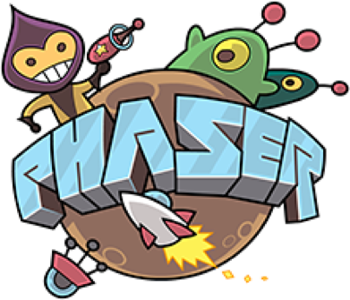

### Hi there 👋

<!--
**XDEcat-Geek/XDEcat-Geek** is a ✨ _special_ ✨ repository because its `README.md` (this file) appears on your GitHub profile.

Here are some ideas to get you started:

- 🔭 I’m currently working on ...
- 🌱 I’m currently learning ...
- 👯 I’m looking to collaborate on ...
- 🤔 I’m looking for help with ...
- 💬 Ask me about ...
- 📫 How to reach me: ...
- 😄 Pronouns: ...
- ⚡ Fun fact: ...
-->

- 😃 I'm BoBo. I like game development, anime, music, and am good at JavaScript！
- ✨ Learning about typescript and game development `phaser.js`.
- 📫 How to reach me: 492697494@qq.com
### Skill 🛠️
<a href="https://v3.cn.vuejs.org"><code></code></a>
<a href="https://reactjs.org/"><code></code></a>
<a href="https://www.tslang.cn/index.html"><code></code></a>
<a href="https://www.tslang.cn/index.html"><code></code></a>
<a href="https://www.tslang.cn/index.html"><code></code></a>
### Profile 🧪
&emsp;
  

